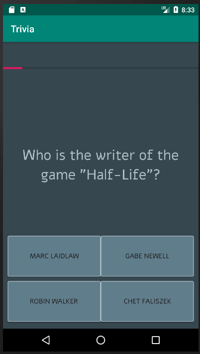
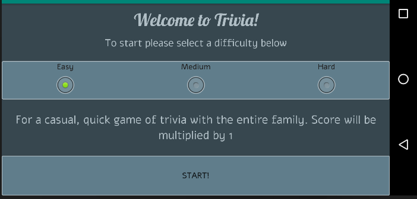

Dit is mijn trivia app.

Je kan kiezen uit drie moeilijkheidsgraden, deze bepalen met hoeveel je score vermenigvuldigd 
wordt als je klaar bent. Klik op de startknop om te beginnen. Easy staat standaard aangevinkt.
Als het spel begint worden de vragen van de server gehaald. Als dit fout gaat krijg je een toast
met de foutmelding.

Tijdens het spel houdt de progresbar boven in het scherm bij hoe ver je bent met het beantwoorden
van de vragen. Als je een vraag goed hebt knippert het scherm 0.1 seconde groen, als je hem fout 
hebt knippert het rood.

Als je klaar bent kan je je highscore opslaan, die van andere zien en een nieuw spel beginnen.
Als je je naam invult en op save drukt wordt je score opgeslagen. Als je geen naam invult voor je
op save drukt krijg je een toast met een melding. Als je score gepost is krijg je een toast melding 
dat het is gelukt, als het fout gaat krijg je ook een melding. Ook krijg je een toast melding
als er iets fout gaat bij het ophalen van de highscores.

